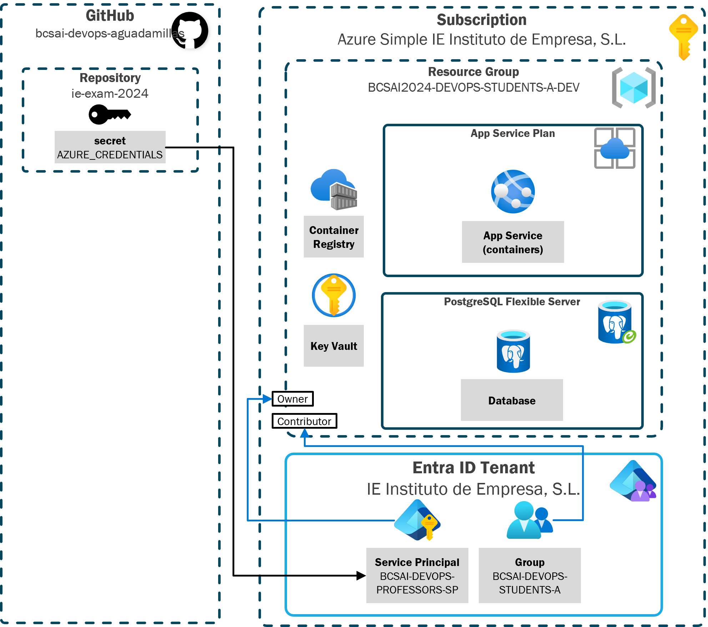
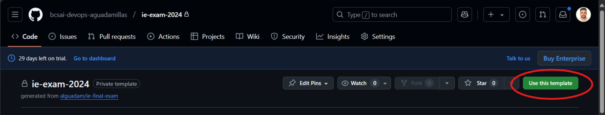
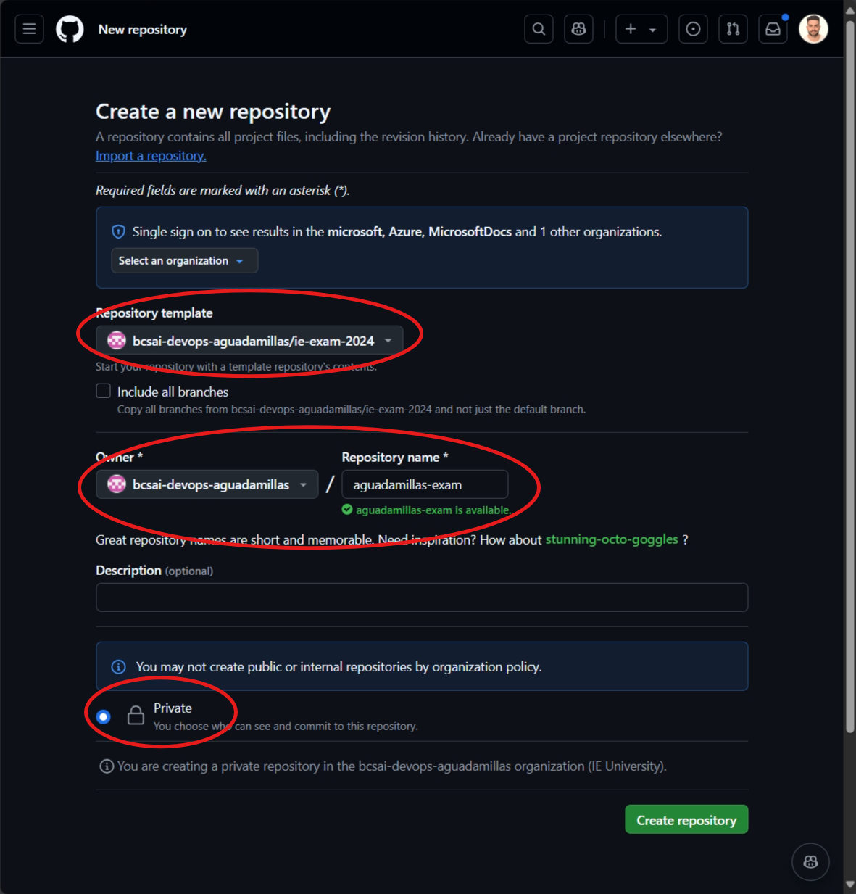

# IE final exam

## Characters API: MMORPG League of Learners

For this exercise, you will be working on a repository that contains a python API is part of the worldwide acclaimed MMORPG game (massive(ly) multiplayer online role-playing game) League of Learners (LoL).

Infrastructure diagram:



This API allows users to create characters in the game, and it will be deployed to Azure via infrastructure as code and GitHub workflows.

This repository contains:
- Backend code: [`/backend/`](/backend/)
- Infrastructure code: [`/infra/`](/infra/)
- Deployment workflows: [`.github/workflows/`](.github/workflows/)

The GitHub organization where this repository is hosted contains the following Organization GitHub secret:
- `AZURE_CREDENTIALS`. You can use this secret to Login to Azure with the service principal with permissions to deploy to resource group `BCSAI2024-DEVOPS-STUDENTS-A-DEV`

```json
```

To work on this exercise:
1. Create your repository with name `{student-alias}-exam` from this repository template.
   - You can create it from the GitHub portal: click on the green button on the top right corner: `Use this template`.
   - Create the new repository in the organization created for the exam: `bcsai-devops-aguadamillas`.
   - Set it to **Private**.
2. In your new repository, don't work directly in the `main` branch. **Create a development branch** from `main` with the name `{student-alias}-dev`.
3. In order to submit your results, create a **Pull Request** from your development branch to your main branch for all the questions. Provide your Pull Request link as an answer in the Blackboard exam.

Note: User/student alias is the assigned user name to your email address before your `@student.ie.edu` (e.g. the user alias of `aguadamillas@faculty.ie.edu` is `aguadamillas`)

The screenshots below show how the use the repository template button that you must use to create your repository:

Use this Template:


Create repository from Template:


Recommended strategy for the exam:
1. Start with **Exercise I**. Make your CI/CD workflow work for your infrastructure code with main.bice deploying 1 sample module. Check that the deployment to Azure works and that your CI/CD workflow works on every push to your dev branch.
2. With Exercise I completed, focus on **Exercise II** and make your infrastructure configuration work
3. **Exercise III** does not require that you have your infrastructure deployed.
4. With the Infrastructure deployed, work on **Exercise IV** and make your CI/CD workflow publish your image to the Docker Container Registry and deploy to your backend service.
5. There is an exercise for extra credit that requires all previous exercises to work correctly. Focus on this exercise only if you have time left.

## Exercise I (1,5 points) - Set up your CI/CD strategy for your Infrastructure as Code in the development environment
_Objective: develop the GitHub workflow to configure the build and deploy steps for the infrastructure of your development environment in Azure_

Use the following files (each file contains comments with the details of what needs to be developed):
- **[`/infra/main.bicep`](/infra/main.bicep) *(optional)***. Use this file to configure:
  - *Lines 10-19*. The deployment of a sample module from [/infra/modules/](/infra/modules/) folder to test that your CI/CD workflow works
- **[`/infra/parameters/dev.parameters.json`](/infra/parameters/dev.parameters.json) or [`/infra/parameters/dev.bicepparam`](/infra/parameters/dev.bicepparam) *(optional)***. Use any of these files to configure the parameters required to deploy your `main.bicep` file.
- **[`/.github/workflows/ie-bank-infra.yml`](/.github/workflows/ie-bank-infra.yml)**. Use this file to configure the CI/CD workflow of your infrastructure.
  - *Lines 18-22*: Write the steps required for infrastructure continuous integration
  - *Lines 31-40*: Write the steps for infrastructure continuous deployment
  - You can leverage the GitHub secret `AZURE_CREDENTIALS` (already exists in the organization).
  - You must pass FlexibleSQL Server credentials via GitHub secrets `DBPASS` and `DBUSER`, they should not be included in your parameters file.

As an answer to this question, provide in Blackboard (question 1):
1. The link to your Pull Request to the main branch (the same Pull Request for the entire exam)
2. The link to the GitHub action run
3. Include a brief description of the changes you made

To pass this question:
- The GitHub workflow must successfully run (green state) and deploy the  infrastructure declared in `main.bicep` to Azure

## Exercise II (1,5 points) - Set up your Infrastructure as Code configuration for your development environment
_Objective: develop the bicep files containing the configuration of your development environment, and deploy the infrastructure to Azure._

Use the following files (each file contains comments with the details of what needs to be developed):
- **[`/infra/main.bicep`](/infra/main.bicep)**. Use this file to configure:
  - *Lines 1-9*. Declare the input parameters for your `main.bicep` that you will use to configure your development environment.
  - *Lines 11-onwards*. Set up the modules required to deploy a containers infrastructure to host your backend. The available modules work as follows:
    - [`infra/modules/app-service-container.bicep`](infra/modules/app-service-container.bicep): This module deploys an App Service Container website, required to host and run your container images from a Docker Container Registry. It requires an App Service Plan
    - [`infra/modules/app-service-plan.bicep`](infra/modules/app-service-plan.bicep): This module deploys an App Service Plan for Linux, required to host App Services of any kind.
    - [`infra/modules/container-registry.bicep`](infra/modules/container-registry.bicep): This module deploys an Azure Container Registry, required to publish your container images
    - [`infra/modules/postgre-sql-db.bicep`](infra/modules/postgre-sql-db.bicep): This module deploys an PostgreSQL Database, required to manage your application data. It requires a PostgreSQL Server.
    - [`infra/modules/postgre-sql-server.bicep`](infra/modules/postgre-sql-server.bicep): This module deploys a PostgreSQL server, required to host multiple databases for your application.
  - **NOTE**: module `key-vault.bicep` is not required for this exercise
- **[`/infra/parameters/dev.parameters.json`](/infra/parameters/dev.parameters.json) or [`/infra/parameters/dev.bicepparam`](/infra/parameters/dev.bicepparam) *(optional)***. Use any of these files to configure the parameters required to deploy your `main.bicep` file.

As an answer to this question, provide in Blackboard (question 2):
1. The link to your Pull Request to the main branch (the same Pull Request for the entire exam)
2. The link to the GitHub action run
3. Include a brief description of the changes you made

To pass this question:
- The infrastructure must deploy to Azure leveraging the GitHub workflow from Exercise I

## Exercise III (1,5 points) - Continuous Quality through Unit and Functional testing
_Objective: develop unit tests and functional tests to check quality of your Backend API._

Use the following files (each file contains comments with the details of what needs to be developed):
- **[`/backend/tests/unit/test_model.py`](/backend/tests/unit/test_model.py)**. Use this file to configure unit testing for code in file [`/backend/character_api/models.py`](/backend/character_api/models.py)
- **[`/backend/tests/functional/test_routes.py`](/backend/tests/functional/test_routes.py)**. Use this file to configure functional testing for code in file [`/backend/character_api/routes.py`](/backend/character_api/routes.py)

As an answer to this question, provide in Blackboard (question 2):
1. The link to your Pull Request to the main branch (the same Pull Request for the entire exam)
3. The link to the GitHub action run
4. Include a brief description of the changes you made

To pass this question:
- The unit tests and the functional tests must be correct according to the test descriptions
- The tests must pass in your workflow run

## Exercise IV (1,5 points) - Continuous delivery of Python backend
_Objective: develop the GitHub workflow to configure the build and deploy steps for your container based backend API._

Use the following files (each file contains comments with the details of what needs to be developed):
- **[`/.github/workflows/ie-bank-backend.yml`](/.github/workflows/ie-bank-backend.yml)**. Use this file to configure the build and deploy jobs of the GitHub workflow for your backend API:
  - *Lines 11-14*: Set up your environment variables
  - *Lines 24-51*: Write the steps for the code test and docker image build and publish
  - *Lines 60-65*: Write the steps for the docker image configuration in Azure web app for containers
  - You can leverage the GitHub secret `AZURE_CREDENTIALS` to log in to Azure
- **[`/infra/main.bicep`](/infra/main.bicep)** or **[`/infra/parameters/dev.parameters.json`](/infra/parameters/dev.parameters.json) or [`/infra/parameters/dev.bicepparam`](/infra/parameters/dev.bicepparam)** files. Update these files to:
  - Make sure that you configure the required environment variables for the backend API runtime when deploying the `app-service-container` module. Check the required environment variables in your backend code files: [`/backend/config.py`](/backend/config.py) and [`/backend/character_api/__init__.py`](/backend/character_api/__init__.py)

As an answer to this question, provide in Blackboard (question 2):
1. The link to your Pull Request to the main branch (the same Pull Request for the entire exam)
2. The link to the GitHub action run
3. Include a brief description of the changes you made

To pass this question:
- The workflow must run successfully
- The linter and the test execution steps must pass
- The docker image must be published into the Azure Container Registry Service as part of your GitHub workflow
- The docker image must run in the hosting Azure container web app as a result of the execution of your GitHub workflow

## Extra exercise (1 extra point) - Secure Secrets management for Container Registry
_Objective: leverage Key Vault module to manage the Container Registry credentials as key vault secrets in Azure_

Use the following files (each file contains comments with the details of what needs to be developed):
- **[`/infra/main.bicep`](/infra/main.bicep) *(optional)***. Update this file to use the Key Vault module. *NOTE: This module already includes all the necessary role assignments to read key vault secrets for students and administer key vault secrets for service principals*
- **[`infra/modules/container-registry.bicep`](/infra/modules/container-registry.bicep)**. Update this module to configure the Container Registry `username`, `password0` and `password1` as key vault secrets instead of outputs
- **[`/infra/main.bicep`](/infra/main.bicep) *(optional)***. Update this file to use the Key Vault secrets containing credentials of Container Registry in the Container Web App (instead of using the Container Registry module outputs)
- **[`/.github/workflows/ie-bank-backend.yml`](/.github/workflows/ie-bank-backend.yml)**. Update this file to obtain the Docker Container Registry credentials from the Key Vault in your build steps.

As an answer to this question, provide in Blackboard (question 2):
1. The link to your Pull Request to the main branch (the same Pull Request for the entire exam)
2. The link to the GitHub action run
3. Include a brief description of the changes you made

To obtain credit for this question:
- The secrets management implementation must work